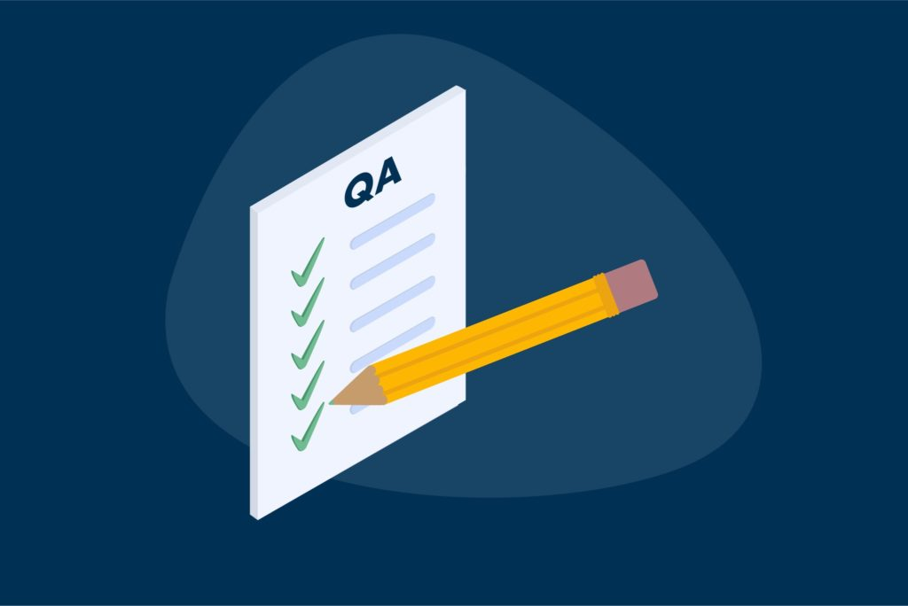

<!-- _class: title -->

# Jak żyć z dokumentacją?

Paweł Wiszniewski

---

<!-- class: content -->
<!-- paginate: true -->

## Agenda

1. Jest jak jest
2. Nie musi być tak źle
3. Jak to dokumentacja bez Worda? - Docs as code

---

<!-- _class: title -->

# Jest jak jest
Czyli codzienne problemy

---

<!-- footer: Jest jak jest -->

## Kiedy ostatnio dokumentacja zawiodła?
|||
| - | - |
|Oczywiście w kryzysowej sytuacji, gdy nikt nie wie jak coś powinno działać...||

---

## Jak wytłumaczyć brak dokumentacji?

- brak czasu
- niechęć do pisania dokumentacji
- kod / sposób działania wydaje się oczywisty
- "working software over comprehensive documentation"
- brak techwriterów w projekcie

---

## Co to jest wiedza plemienna?

- dziwne, niestandardowe, tzw. zdrutowane rozwiązania, które powstały przez brak czasu na realizację w prawidłowy sposób
- niekompletna wśród wszystkich w zespole oraz nieudokumentowana
- ktoś kto dołącza do projektu nie zdaje sobie z tego sprawy
- odejście guru pewnego tematu z projektu, może wiązać się z jej utratą

---

<!-- _class: title -->
<!-- footer: "" -->

## Nie musi być tak źle

---

<!-- footer: Nie musi być tak źle -->

## A może jednak dokumentacja tworzy się sama? - dokumentacja niejawna

- powstaje podczas analizy, rozpisywana, rozdzielania zadań pomiędzy developerami oraz  podczas komunikacji z klientem
- skupia się na fragmencie projektu a nie na całym jego zakresie
- nie koniecznie jest rozbudowanym opisem, zawierającym np. instrukcje używania funkcjonalności

---

## Wady dokumentacji niejawnej

- nie jest zebrana w jednym miejscu
- możliwość przeoczenia wad rozwiązania, gdy całokształt nie jest widoczny
- informacje mogą być niekompletne bądź nieaktualne w niektórych miejscach

---

## Co jeszcze okazuje się pomocne?

W projektach znajdują się przyjaciele dokumentacji - **testy**.
|||
|-|-|
||A testy nie powinny być pisane na podstawie dokumentacji?|

---

## Testy bez dokumentacji

- w rzeczywistości często testy tworzone są na podstawie komunikacji z developerami lub po prostu tworzą je sami
- testy są również dokumentacją niejawną dla programistów:
	* testy jednostkowe - założenia działania poszczególnych elementów
	* testy funkcjonalne i integracyjne - wymagania funkcjonalne oraz sposób współpracy całego systemu
- aktualne
- czytelne dla developerów

---

## Pomysły na dokumentację w Scrumie

- przygotowanie zadań przed sprint planingiem
- wydzielony czas w każdym sprincie
- proste opisy zadań

---

## Pozostałe drobne usprawnienia

- ustalenie co jest nam potrzebne
- zwrócenie uwagi na to, że dokumentacja służy do komunikacji ze sobą z przyszłości/przeszłości
- dokumentowanie rzeczy z pozoru oczywiste
- dokumentowanie wiedzy plemiennej
- dokumentowanie błędów i ich rozwiązania
- decyzja czy dokumentację tworzymy w bloku czy sukcesywnie podczas realizacji funkcjonalności

---

## Co by było, gdyby stworzyć dokumentację przed realizowaniem projektu?

- nie zawsze możliwe
- łatwiejsze wyodrębnienie zadań
- obraz całego rozwiązania
- zmniejszenie ryzyka wystąpienia problemów
- ułatwienie w ocenieniu zmian w stosunku do pierwotnej wersji

---
<!-- footer: "" -->
<!-- _class: title -->

# Jak to dokumentacja bez Worda? - Docs as code

---

<!-- footer: Jak to dokumentacja bez Worda? - Docs as code -->

## Jaka jest idea "Docs as code"?

 - upodobnienie procesu tworzenia dokumentacji do procesu tworzenia kodu aplikacji
 - przyspieszenie tworzenia dokumentacji
 - usprawnienie wersjonowania, zastosowanie systemu kontroli wersji

---

## Jakie są możliwości?

- narzędzia do tworzenia plików tekstowych, diagramów oraz bardziej zaawansowanych, interaktywnych rozwiązań np. z wykorzystaniem Markdown
- tworzenie dokumentacji w IDE, np. w Visual Studio Code
- wykorzystanie rozwiązań z programowania typu if, for, kolekcji

|||
|-|-|
|||

---

## Co nam to faktycznie daje?

- zwiększenie łatwości i szybkości tworzenia/edycji dokumentacji w trakcie wykonywania zadań
- możliwość przechowywania dokumentacji w repo:
	* sprawdzanie dokumentacji w trakcie code review
	* automatyczna aktualizacja dokumentacji w trakcie wdrożeń
- dokumentacja żyje razem z kodem i jest poważniej traktowana

---

## Takie wspaniałe rozwiązanie posiada wady?

- techwriterzy mogą miec trudności
- tak jak podczas tworzenia aplikacji, mogą pojawić się różnego rodzaju błędy np. kompilacji
- początkowa konfiguracja rozwiązania
- czasem wymagana dodatkowa konfiguracja przy lokalnym uruchamianiu

---

## Czy ktoś tego używa?

|||
|-|-|
|||
|Spotify for developers      |Netflix Devices|

---

## Jekyll

- zaprojektowany do tworzenia blogów, ale nadaje sie świetnie do tworzenia interaktywnej dokumentacji
- domyślnie wspierany przez Github Pages
- dosyć prosty w konfiguracji i uruchamianiu

---

## Konfiguracja

|Github|Lokalnie|
|-|-|
||Instalacja Ruby z devkitem, jekyll, bundler, następnie instalacja pakietów z bundle oraz uruchomienie lokalnego serwera.|

---

## Jekyll demo

---

## Demo 2 - prezentacja

|||
|-|-|
||Prezentacja została wykonana przy pomocy frameworka Marpit.|

---

## Materiały
- https://testerzy.pl/baza-wiedzy/artykuly/jak-poprawnie-tworzyc-dokumentacje
- https://wedlugplanu.pl/001/
- https://www.writethedocs.org/
- https://bulldogjob.pl/articles/779-pisz-dokumentacje-tak-jak-kod
- https://docs-as-co.de/
- https://jekyllrb.com
- https://docs.github.com/en/pages/setting-up-a-github-pages-site-with-jekyll

---

## Koniec
Dziękuję za uwagę!