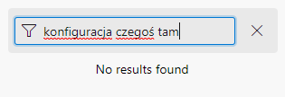
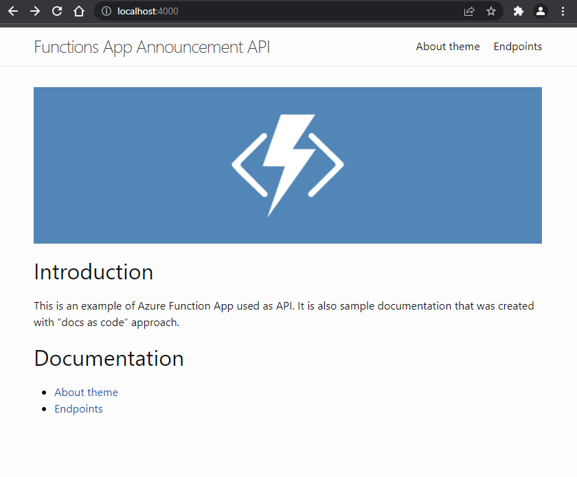

<!-- footer: 25.04.2023 -->

# Jak żyć z dokumentacją?

### Paweł Wiszniewski

---

<!-- class: content -->
<!-- paginate: true -->

# O mnie

- .NET Developer w Billennium
- Entuzjasta technologii
- Rowerek, motoryzacja i fotografia
- E-mail: pawel.wiszniewski20@gmail.com

---

# Agenda

1. Jest jak jest
2. Nie musi być tak źle
3. Jak to dokumentacja bez Worda? - Docs as code

---

<!-- _class: title -->

# Jest jak jest

Czyli codzienne problemy

---

## Kiedy ostatnio dokumentacja zawiodła?

Oczywiście w kryzysowej sytuacji, gdy nikt nie wie jak coś powinno działać...

---

##### Autentyk z projektu legacy

### Zarys sytuacji

> Nie działa automatyczne uruchamianie procesu **A** po pewnej dacie **X**

- Według użytkowników i aktualnej wiedzy w zespole data **X** pochodzi z procesu **B**
- System jest bardzo rozbudowany i ludzie tworzący go dawno poszli w świat

---

##### Autentyk z projektu legacy

## Finał po wielogodzinnym szukaniu

1. Utworzeniu użytkownika w innym systemie
2. Integracja inny system -> Active Directory
3. Integracja AD -> nasz system
4. Utworzenie procesu **B**, wprowadzenie daty **X**
5. Na pewnym etapie procesu jest tworzony i przypinany do użytkownika obiekt **Y**
6. Uruchamiany jest proces **C**, do zatwierdzenia użytkownika
7. Od tego momentu w tle działa task, uruchamiajacy procesy **A** na podstawie dat z obiektu **Y**

---

##### Autentyk z projektu legacy

### Wyszło, że funkcjonalność składa się z 6 różnych mechanizmów zamiast z 1 - 2 xD

---

# Jak wytłumaczyć brak dokumentacji?
- Brak czasu
- Sposób działania wydaje się oczywisty
- *A komu to potrzebne?*

---

## Co to jest wiedza plemienna?

- Tzw. zdrutowane rozwiązania
- Niekompletna wśród członków zespołu
- Odejście guru pewnego tematu z projektu = utrata

---

<!-- _class: title -->

# Nie musi być tak źle

---

## A może jednak dokumentacja tworzy się sama? - dokumentacja niejawna

- Powstaje podczas analizy, komunikacji z klientem
- Skupia się na fragmencie projektu a nie na całym jego zakresie
- Nie koniecznie jest rozbudowanym opisem

---

## Wady dokumentacji niejawnej

- Nie jest zebrana w jednym miejscu i usystematyzowana
- Możliwość przeoczenia wad rozwiązania
- Informacje mogą być nieaktualne

---

## Co jeszcze okazuje się pomocne?

W projektach znajdują się przyjaciele dokumentacji - **testy**.

> A testy nie powinny być pisane na podstawie dokumentacji?

---

## Testy bez dokumentacji

- Bez scenariuszy
- Testy są również dokumentacją niejawną dla programistów
- Aktualne

---

## Jak żyć z dokumentacją

- Ustalenie potrzeb
- Wszystkie informacje i ich modyfikacje w jednym miejscu
- Wydzielony czas w każdym sprincie

---

## Co jeszcze?

- Przyjnajmniej minimum
- Dokumentacja służy do komunikacji ze sobą z przyszłości/przeszłości
- Zebranie wiedzy plemiennej, informacji o bugach, itp

---

## Co by było, gdyby stworzyć dokumentację przed realizowaniem projektu?

- łatwiejsze wyodrębnienie zadań
- obraz całego rozwiązania
- zmniejszenie ryzyka wystąpienia problemów
- ułatwienie w ocenieniu zmian w stosunku do pierwotnej wersji

---
<!-- _class: title -->

###### Co by było, gdyby stworzyć dokumentację przed realizowaniem projektu?

# Niestety niemożliwe

---

<!-- _class: title -->

# Jak to dokumentacja bez Worda? - Docs as code

---

## Jaka jest idea "Docs as code"?

> Upodobnienie procesu tworzenia dokumentacji do procesu tworzenia kodu aplikacji
 
 

|||
|-|-|
|||

---

## Co nam to faktycznie daje?

edycja wraz z kodem
+
sprawdzanie w trakcie code review
+
automatyzacja

= dokumentacja żyje razem z kodem i jest poważniej traktowana

---

## Takie wspaniałe rozwiązanie posiada wady?

- osoby nieobeznane z kodem mogą miec trudności
- początkowa konfiguracja i błędy podczas kompilacji

---

## Czy ktoś tego używa?

|||
|-|-|
|||
|Spotify for developers      |Netflix Devices|

---

## Jekyll

- zaprojektowany do tworzenia blogów
- domyślnie wspierany przez Github Pages

---

## Jekyll demo

---

## Demo 2 - prezentacja

|||
|-|-|
||Prezentacja została wykonana przy pomocy frameworka Marpit.|

---

## Materiały
- https://testerzy.pl/baza-wiedzy/artykuly/jak-poprawnie-tworzyc-dokumentacje
- https://wedlugplanu.pl/001/
- https://www.writethedocs.org/
- https://bulldogjob.pl/articles/779-pisz-dokumentacje-tak-jak-kod
- https://docs-as-co.de/
- https://jekyllrb.com
- https://docs.github.com/en/pages/setting-up-a-github-pages-site-with-jekyll

---

