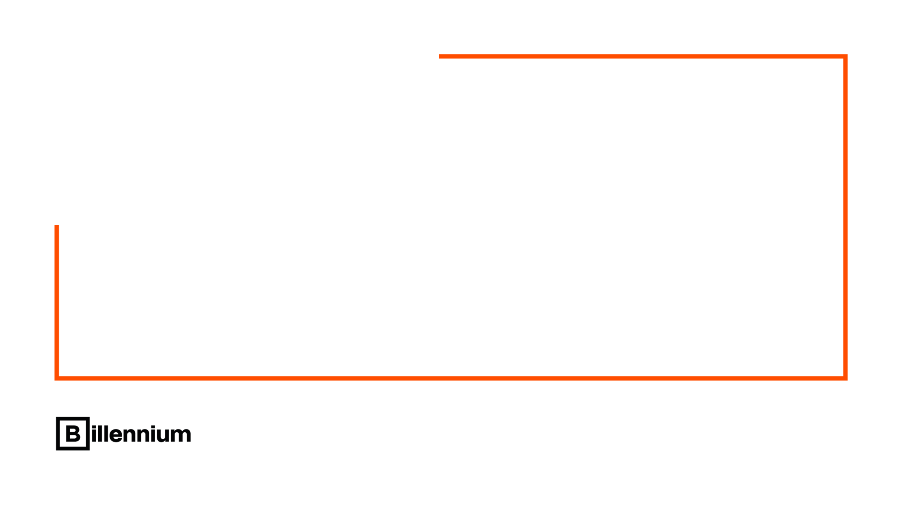
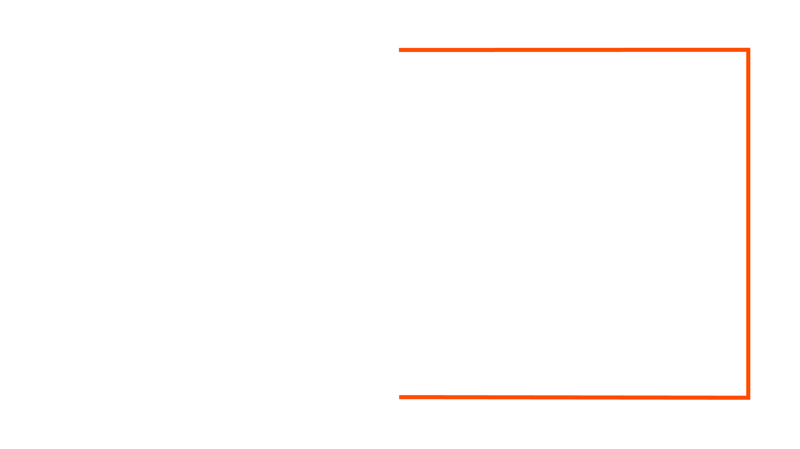
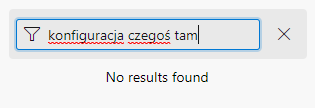
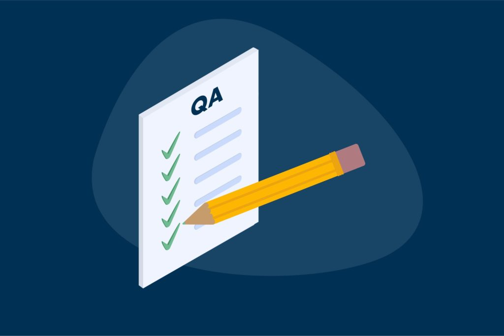
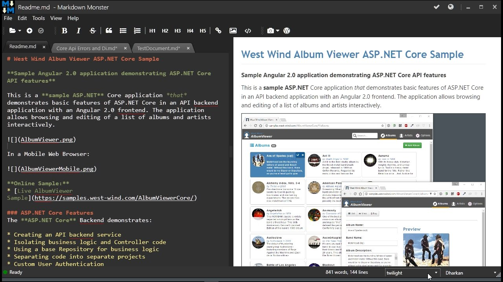
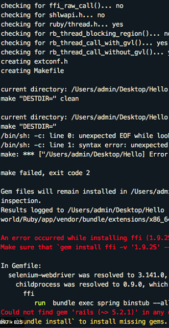
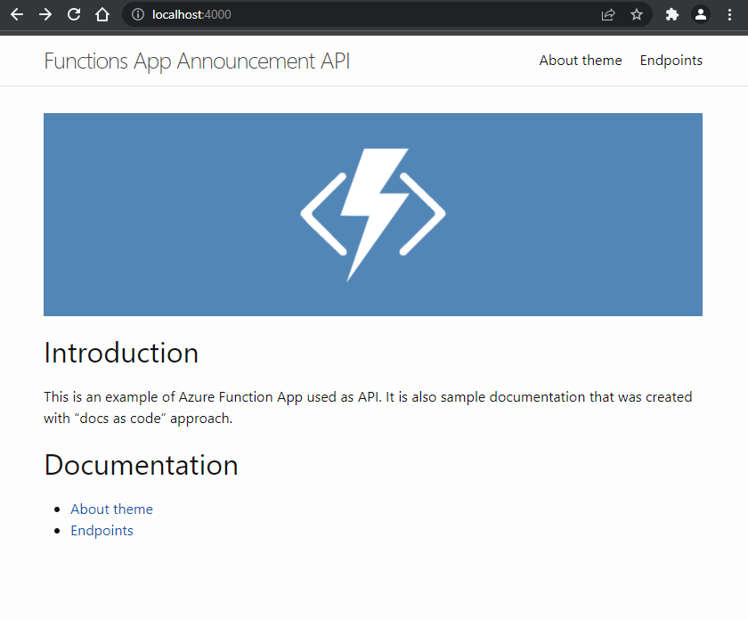
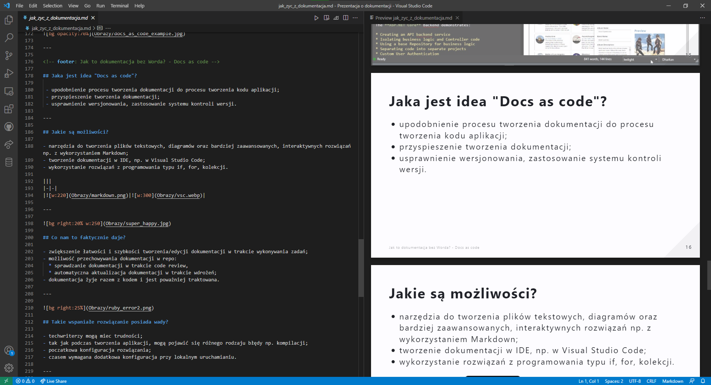

<!-- _class: lead -->
<!-- footer: 15.09.2022 -->

# Jak żyć z dokumentacją?

### Paweł Wiszniewski

---

<!-- _class: content image-right-bottom -->
<!-- paginate: true -->

# O mnie

- Junior .NET Developer w Billennium
- Student Informatyki na Politechnice Białostockiej
- Email: pawel.wiszniewski20@gmail.com
- Czasem fotograf

---

<!-- _class: content content-right -->

# Agenda

1. Jest jak jest
2. Nie musi być tak źle
3. Jak to dokumentacja bez Worda? - Docs as code

---

<!-- _class: title -->

# Jest jak jest

Czyli codzienne problemy

---

<!-- _class: content content-right image-right -->

## Kiedy ostatnio dokumentacja zawiodła?

Oczywiście w kryzysowej sytuacji, gdy nikt nie wie jak coś powinno działać...

---
<!--- _class: content content-right -->

# Jak wytłumaczyć brak dokumentacji?

- brak czasu
- niechęć do pisania dokumentacji
- kod / sposób działania wydaje się oczywisty
- brak techwriterów w projekcie

---

## Co to jest wiedza plemienna?

- tzw. zdrutowane rozwiązania
- niekompletna wśród członków zespołu
- odejście guru pewnego tematu z projektu = utrata

---

<!-- _class: image-right -->

# Nie musi być tak źle

---

<!-- _class: content content-right -->

## A może jednak dokumentacja tworzy się sama? - dokumentacja niejawna

- powstaje podczas analizy, komunikacji z klientem
- skupia się na fragmencie projektu a nie na całym jego zakresie
- nie koniecznie jest rozbudowanym opisem

---

## Wady dokumentacji niejawnej

- nie jest zebrana w jednym miejscu
- możliwość przeoczenia wad rozwiązania
- informacje mogą być nieaktualne

---

<!-- _class: content image-right -->

## Co jeszcze okazuje się pomocne?

W projektach znajdują się przyjaciele dokumentacji - **testy**.

*A testy nie powinny być pisane na podstawie dokumentacji?*

---

<!--  -->

## Testy bez dokumentacji

- bez scenariuszy
- testy są również dokumentacją niejawną dla programistów
- aktualne

---
<!-- _class: content content-right -->

## Jak żyć z dokumentacją

- wszystkie ustalenia i zmiany w jednym miejscu
- wydzielony czas w każdym sprincie
- proste opisy zadań

---

## Co jeszcze?

- ustalenie potrzeb
- dokumentacja służy do komunikacji ze sobą z przyszłości/przeszłości
- wiedza plemienna, bugi, itp

---

<!-- _class: content content-wide -->

## Co by było, gdyby stworzyć dokumentację przed realizowaniem projektu?

- łatwiejsze wyodrębnienie zadań
- obraz całego rozwiązania
- zmniejszenie ryzyka wystąpienia problemów
- ułatwienie w ocenieniu zmian w stosunku do pierwotnej wersji

---

<!-- _class: content -->

## Niestety niemożliwe

---

<!-- _class: title -->

# Jak to dokumentacja bez Worda? - Docs as code

---
<!-- _class: content content-wide -->

## Jaka jest idea "Docs as code"?

*upodobnienie procesu tworzenia dokumentacji do procesu tworzenia kodu aplikacji*

 |||
|-|-|
|||

---

<!-- _class: content image-right -->

## Co nam to faktycznie daje?

edycja wraz z kodem
+
sprawdzanie w trakcie code review
+
automatyzacja

= dokumentacja żyje razem z kodem i jest poważniej traktowana

---

## Takie wspaniałe rozwiązanie posiada wady?

- techwriterzy mogą miec trudności
- początkowa konfiguracja i błędy podczas kompilacji

---

<!-- _class: content content-wide -->

## Czy ktoś tego używa?

|||
|-|-|
|||
|Spotify for developers      |Netflix Devices|

---
<!-- _class: content image-right -->

## Jekyll

- zaprojektowany do tworzenia blogów
- domyślnie wspierany przez Github Pages

---

## Jekyll demo

---

<!-- _class: content content-wide -->

## Demo 2 - prezentacja

|||
|-|-|
||Prezentacja została wykonana przy pomocy frameworka Marpit.|

---

## Materiały
- https://testerzy.pl/baza-wiedzy/artykuly/jak-poprawnie-tworzyc-dokumentacje
- https://wedlugplanu.pl/001/
- https://www.writethedocs.org/
- https://bulldogjob.pl/articles/779-pisz-dokumentacje-tak-jak-kod
- https://docs-as-co.de/
- https://jekyllrb.com
- https://docs.github.com/en/pages/setting-up-a-github-pages-site-with-jekyll

---

<!-- _class: image-right -->

# Koniec
